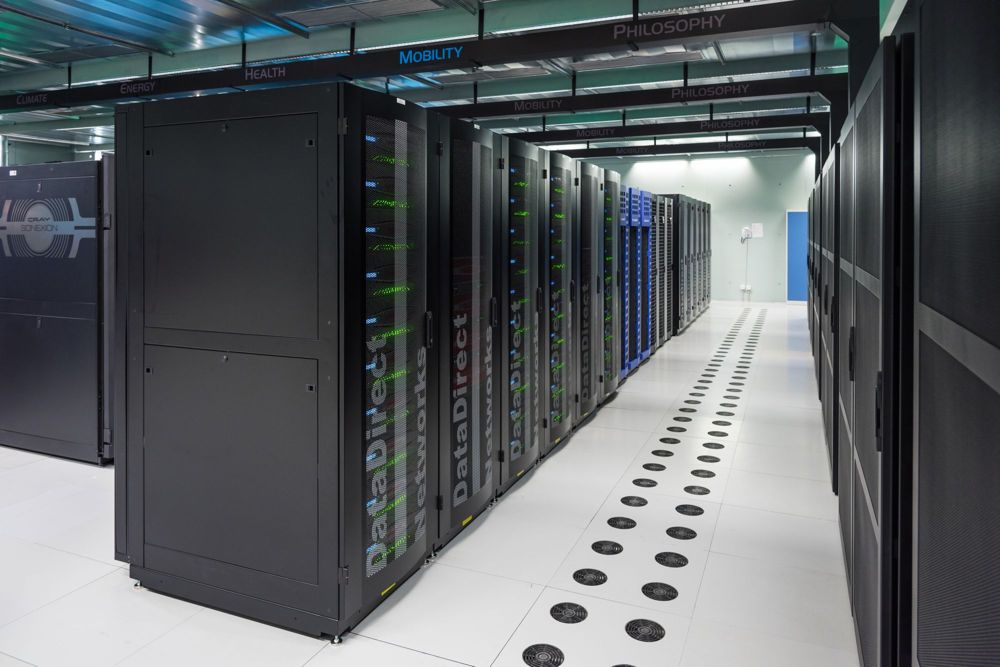
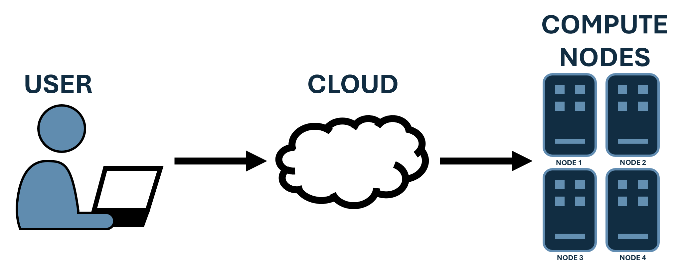

# What is Vega?

Vega is the CFAL lab's on-premise High Performance Computing (HPC) cluster. It is used for large-scale simulations and data processing tasks that are too demanding for a personal computer or workstation. If you are new to HPC, this page will give you a quick overview of what it is, when to use it, and what Vega's hardware looks like.

---

## What is an HPC Cluster?

*Source: [Julio's Blog](https://www.juliosblog.com/high-performance-computing-hpc-on-openstack-a-few-recommendations/)*

An HPC (High Performance Computing) cluster is a **group of powerful interconnected computers (nodes)** that work together to perform complex computations much faster than a single computer.

Each node has its own CPU and memory. All nodes communicate over a high-speed network and together act as one unified system. While your personal laptop/desktop might have 4-16 cores and 8-64 GB of RAM, an HPC cluster can include hundreds or thousands of nodes each with dozens of cores and hundreds of gigabytes of memory. You, the user, can connect to the cluster remotely, request a specific amount of resources (e.g., number of nodes, CPU cores, memory), and run your jobs.

### CPU vs. GPU Computing

Most HPC work runs on **CPU nodes**, which are well-suited for general-purpose parallel computation things like CFD solvers, meshing, and data analysis.

**GPU nodes** are fundamentally different. GPUs have thousands of smaller, simpler cores designed to handle many operations simultaneously. They excel at highly parallelized workloads such as machine learning, deep learning inference, and certain physics solvers that are written to take advantage of GPU acceleration. Not all software can use GPUs it must be specifically written or configured to do so. Nowadays, many CFD solvers (STAR-CCM+ included) have been moving to GPU-accelerated solvers, so it's becoming more common to see GPU nodes in HPC clusters.

We will go over more of the differences later.

---

## When Should You Use an HPC?

**Use Vega when:**
- Your simulation needs more processing power or memory than your local machine can provide.
- The workload can be split into smaller, independent parts that run in parallel.
- You need to run many simulations simultaneously.
- You want to free up your local machine while long jobs run remotely.

**Do not use Vega when:**
- Your task runs quickly on your local machine.
- The code cannot run in parallel or is not designed for it.
- You are doing interactive or graphical work (e.g., live plotting, GUI tools).

---

## Vega Hardware

### CPU Nodes
- **42 nodes**, each with 2× AMD EPYC 9654 (96 cores/CPU, 192 cores/node)
- **1.5 TB RAM** per node
- **8,064 total cores**, **63 TB total memory**

### GPU Nodes
- **2 nodes**, each with 4× NVIDIA H100 (80 GB VRAM each)
- **320 GB GPU memory** per node

**Although an HPC cluster offers many cores, it's important to understand the various nuances of using them effectively since resource allocation and job scheduling can significantly impact performance.**

For full hardware and software specs, see the [Vega Hardware Reference](../reference/vega_hardware.md).

---

Next: [Accessing Vega](./02_access_setup.md)