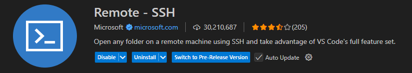
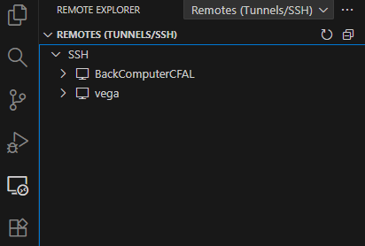

# Accessing Vega

Traditionally, users accessed Vega via SSH using tools such as MobaXterm or PuTTY. However, **Visual Studio Code (VS Code)** offers a more integrated environment with a built-in terminal, file browser, editor, and many other extensions. This guide covers how to connect to Vega using VS Code. It is not meant to be a comprehensive tutorial on using VS Code, but rather a quick setup guide to get you connected and ready to work on Vega.

> **Note:** Connecting to Vega requires VPN access unless you are on a campus wired network, as well as valid authentication credentials. This guide does not cover VPN or credential setup.

---

## Step 1: Install the Remote SSH Extension

Install the **Remote - SSH** extension from the VS Code Marketplace.



This extension allows you to open a remote terminal, edit files, and manage your HPC environment directly within VS Code.

---

## Step 2: Open the Remote Explorer

After installation, a new icon will appear in the left sidebar — a computer symbol with `><`.

Click this icon to open the **Remote Explorer**. From here you can manage and connect to SSH hosts.



The image above shows the Remote Explorer with 2 SSH hosts already configured. Yours will most likely be empty until you add Vega as a new SSH host.

---

## Step 3: Add and Connect to Vega

1. Hover over the **SSH** tab in the Remote Explorer — a **+** icon will appear. Click it to add a new connection.
2. Enter your SSH connection string at the top of the VS Code window:
    ```
    ssh username@vegaln1.erau.edu
    ```
    Replace `username` with your actual Vega username.
3. When prompted, select the SSH configuration file to update. The default is usually:
    ```
    C:\Users\yourname\.ssh\config
    ```
    This file will be stored on your local computer and is essentially a list of all the SSH connections you have set up, along with any specific settings for each host so you don't have to remember them every time.
4. Return to the **Remote Explorer**. Hover over your new connection and click the arrow icon that appears to connect.
5. On first connection, VS Code will ask which platform you are connecting to — select **Linux**.
6. Enter your Vega password when prompted and press **Enter**.

---

## Step 4: Set Up SSH Keys (Optional)

To avoid entering your password every time you connect, you can configure SSH key authentication.

### Generate an SSH Key Pair

1. Open **PowerShell** or **Command Prompt** on your local machine.
2. Run:
    ```bash
    ssh-keygen -t ed25519 -C "youremail@example.com"
    ```
3. Press **Enter** to accept the default file path, or specify a custom one.
4. Enter a passphrase when prompted (optional but recommended).

Your keys will be saved to `C:\Users\yourname\.ssh\` by default:
- **Private key** (`id_ed25519`) — keep this secure and never share it.
- **Public key** (`id_ed25519.pub`) — this is what gets copied to Vega.

### Copy the Public Key to Vega

1. Copy `id_ed25519.pub` to Vega's `~/.ssh/` folder (if ~/.ssh/ does not exist, create it).
2. On Vega, append the key to the `authorized_keys` file:
    ```bash
    cat id_ed25519.pub >> ~/.ssh/authorized_keys
    ```
3. Set the correct permissions:
    ```bash
    chmod 700 ~/.ssh
    chmod 600 ~/.ssh/authorized_keys
    ```

### Update Your VS Code SSH Config

1. In the Remote Explorer, hover over the **SSH** tab and click the **gear icon** to open the SSH config file.
2. It should look like this:
    ```
    Host vegaln1.erau.edu
        HostName vegaln1.erau.edu
        User yourusername
    ```
3. Add your key and optionally set a short alias:
    ```
    Host Vega
        HostName vegaln1.erau.edu
        User yourusername
        IdentityFile C:\Users\yourname\.ssh\id_ed25519
    ```
4. Save and close the file. You should now be able to connect without entering a password.

**Note: If you set a passphrase for your SSH key, you will still need to enter it when connecting unless you use an SSH agent to manage your keys. It's usually recommend to add a passphrase for security.**

**Lastly, you *can* reuse keys on multiple machines, but it's not recommended.**

---

Next: [Vega Basics](./03_vega_basics.md)