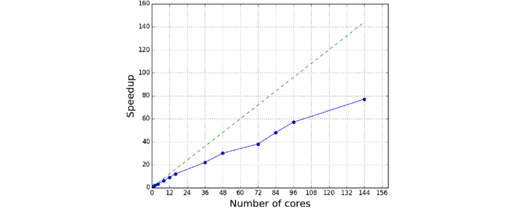

# Resource Planning

Before submitting a job, you need to decide how many nodes, cores, and how much memory to request. Requesting too little will cause your job to crash or run inefficiently. Requesting too much wastes resources, increase your queue wait time, or even cause your job to perform worse due to parallel overhead.

This page focuses on Star-CCM+, but the concepts apply broadly to most CFD and simulation software.

---

## 1. How Hardware Scales

To give a sense of how much HPC can change things, here is a rough comparison of what different hardware looks like for a large simulation:

| Machine | Hardware | Total Cores | Total RAM |
|---------|----------|-------------|-----------|
| Personal Computer | AMD Ryzen 9 7950X | 16 | 32 GB |
| Workstation | AMD EPYC 9654 | 96 | 256 GB |
| Vega (4 nodes) | 2× AMD EPYC 9654 per node | 768 | 6 TB |
| NASA Pleiades | Mixed | 232,416 | 873 TB |

> Runtimes are not listed here because they depend heavily on physics, mesh size, and solver settings. The key takeaway is the order-of-magnitude difference in available resources.

---

## 2. Memory Requirements

Star-CCM+ is primarily **memory-bound**, meaning performance depends more on available RAM than raw CPU speed. Each mesh cell requires a certain amount of memory depending on the physics and solver being used.

### Meshing

| Operation | Memory Estimate |
|-----------|----------------|
| Surface Meshing | ~0.5 GB per million surface triangles |
| Volume Meshing (Polyhedral) | ~1 GB per million cells |
| Volume Meshing (Trimmed) | ~0.5 GB per million cells |

### Solving (Single-phase RANS, two-equation turbulence model)

| Solver | Polyhedral | Trimmed |
|--------|-----------|---------|
| Segregated | 1 GB / million cells | 0.5 GB / million cells |
| Coupled Explicit | 2 GB / million cells | 1 GB / million cells |
| Coupled Implicit | 4 GB / million cells | 2 GB / million cells |

**A few important notes:**
- Polyhedral meshes roughly double the RAM requirement compared to trimmed meshes.
- Parallel runs add slight memory overhead due to inter-node communication.
- Always leave a 10–20% buffer to avoid running out of memory mid-run.

---

## 3. Cell-to-Core Ratio

For efficient parallel performance, target **50,000–100,000 cells per core**. This keeps each core busy without excessive communication overhead between cores.

For a single Vega compute node (192 cores, 1.5 TB RAM):

| | Cells |
|--|-------|
| Minimum (50k/core) | ~9.6 million |
| Recommended (100k/core) | ~19.2 million |

In practice, plan for roughly **10–20 million cells per node** as a starting point to use all available cores in a single node. If my simulation is only 5 million cells, I would only request 1 node and ~96 cores to keep the cell-to-core ratio in the efficient range.

---

## 4. Parallel Scaling

Doubling your core count does not halve your runtime. Scaling is non-linear, and understanding why helps you avoid over-requesting resources.

In CFD, every cell continuously exchanges information with its neighbors — pressure, velocity, turbulence quantities, and so on. As you add more cores, each core handles fewer cells but spends more time communicating with other cores. At some point, the communication overhead outweighs the benefit of adding more cores.

**Analogy:** Think of assembling an airplane. Each section (wings, fuselage, tail, electronics) must be built separately, but they cannot be assembled until neighboring sections are ready. Adding more workers helps up to a point — but too many workers spend more time waiting on each other than actually building.

*Source: [Y. Thorimbert et al., "Virtual Wave Flume and Oscillating Water Column Modeled by Lattice Boltzmann Method"](https://www.researchgate.net/publication/301241406_Virtual_Wave_Flume_and_Oscillating_Water_Column_Modeled_by_Lattice_Boltzmann_Method_and_Comparison_with_Experimental_Data)*

The chart above illustrates how speedup improves nearly linearly at low core counts but efficiency drops off as cores increase. The exact behavior depends on:

- The software (Star-CCM+, FUN3D, OpenFOAM, etc.)
- Hardware architecture (CPU type, memory bandwidth)
- Mesh size and resolution
- Solver settings (turbulence model, discretization schemes)
- Network interconnect speed (Vega uses 100Gb InfiniBand)

**When in doubt, run a quick scaling benchmark** with your specific case before committing to a large multi-node run. This will tell you where the returns start to diminish for your particular setup.

---

## 5. Balancing Memory and Cores

Running CFD is a balancing act between memory and cores. You need enough RAM to hold your simulation data, but you also want enough cores to run it efficiently. To put it very simply:

- **RAM** determines the maximum size of simulation you can run.
- **Cores** determine how fast it runs.

Below are a few scenarios to help better understand this balance:
1. Given 1 billion cells:
    - Low RAM, high cores: Fail due to insufficient memory.
    - High RAM, low cores: Runs but takes an impractically long time.
    - High RAM, even lower cores: Might fail due to too many cells per core
    - Balanced RAM and cores: Runs successfully in a reasonable time.
2. Given 1 million cells:
    - Same as above
    - High RAM, high cores: Runs but with poor efficiency due to too few cells per core.

You could fit hundreds of millions of cells in Vega's memory, but without enough cores the runtime would be impractical. Conversely, requesting many cores without enough memory will crash your job. The goal is to find a balance where both are used efficiently.

A practical starting point for Star-CCM+ on Vega:
- Use the cell-to-core ratio (50k–100k cells/core) to determine core count.
- Use the solver memory tables above to estimate RAM.
- Cross-check both against what a single node provides before deciding whether to span multiple nodes.

---

Next: [Job Submission](./05_job_submission.md)